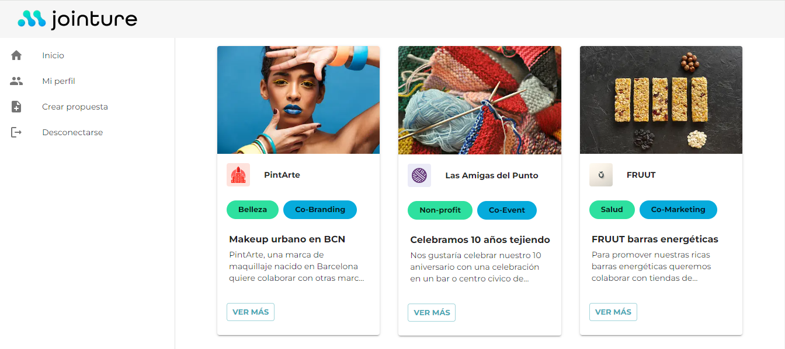
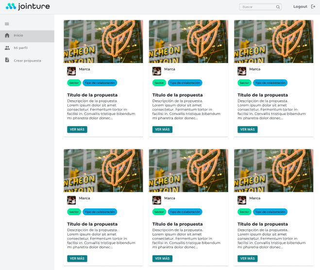
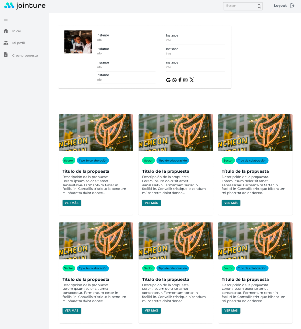

# 👥🤝 Project - Jointure Platform


Jointure is a platform that automates collaborations between brands from various sectors, facilitating seamless interactions and partnerships. Alongside [this backend repository](https://github.com/octocodevs/jointure-backend/tree/main), this fullstack project involves the creation of a responsive website that allows users to explore, create, and manage collaborations. 

This [user flow diagram](https://whimsical.com/web-jointure-HPxbvzLT6opPSX7vJjeBSZ) demonstrates the user's path from the existing [Jointure website](https://jointurenow.myshopify.com/) to the platform designed and implemented in this project. 



## Table of Contents

- [Requirements](#requirements)
- [Technologies](#technologies)
- [Frontend File Structure](#frontend-file-structure)
- [Features](#features)
- [Installation](#installation)
- [Running Tests](#running-tests)
- [Demo](#demo)
- [Developers](#developers)

## Requirements

- Visual Studio Code
- Node.js 
- Composer
- Xampp or mamp


## Technologies:

- Frontend:
  - Node.Js -> 20.0.0
  - Next.js -> 14.1.4
  - React.js -> 18.0.0
  - Tailwind CSS -> 3.3.0
  - Material-UI (MUI) -> 5.15.11
  - Axios -> 1.6.8
  - Jest -> 29.7.0
  - Cypress -> 13.7.2

- Backend:
  - PHP -> 8.0
  - Laravel -> 10.0.0
  - PHPUnit -> 7.1
  - Composer -> 2.6.6
  - MySQL -> 8.0
  - Sanctum -> 3.3

## Frontend File Structure:

- **.next:** Auto-generated files by Next.js during the build process.
- **/node_modules:** Dependencies managed by npm.
- **public/:** Static files accessible directly from the browser.
- **src/:**
  - **/app:**
    - **/admin:**
      - **/login:** Login related components and pages.
      - **/register:** Register related components and pages.
      - **/marketplace:** Components and pages related to the marketplace.
      - **/newcollab:** Components and pages related to creating a new collaboration proposal.
      - **/inbox:** Components and pages related to the user's inbox.
    - **/components:** Reusable UI components used across the application.
      - **/MUI:** Material-UI components.
    - **/services:** Axios API integration and other services.
  - **/pages:** Main application pages.

## Features:

- **Marketplace:** Display collaborations from various users.
- **User Authentication:** Login and registration functionalities.
- **Create Collaboration Proposal:** Users can create and publish collaboration proposal posts.
- **Inbox:** View incoming and pending collaboration proposals.
- **Search Functionality:** Search collaborations by name.
- **Responsive Design:** Optimized for desktop and mobile devices.

## Installation
This repository is the Frontend where the visual part of the website is located. To install it on your computer, follow these steps:

1. Clone the repository:
    ```bash
    git clone https://github.com/octocodevs/jointure-frontend.git
    ```
2. Put in the terminal within the project
    ```bash
    cd jointure-frontend
    ```
    ```bash
    npm install
    ```
3. To open and see the website in the terminal you have to enter
    ```bash
    npm run dev
    ```

## Running Tests

To run tests, run the following command

   ```bash
   npm test
   ```

## Demo






## Developers

[Stephanie Céspedes](https://www.linkedin.com/in/stephanie-cespedes/) <br>
[Vicki Robertson](https://www.linkedin.com/in/vickirobertson/) <br>
[Grecia Landazuri](https://www.linkedin.com/in/grecialh/) <br>
[Carolina Delfa](https://www.linkedin.com/in/carolina-delfa-silvestre/) <br>
[Gabriela Irimia](https://www.linkedin.com/in/gabriela-irimia/) <br>
[Zohra Bellamine](https://www.linkedin.com/in/z-bellamine/) <br>
[Melissa Casola](https://www.linkedin.com/in/melissa-casola/) <br>
[Laura Artaza](https://www.linkedin.com/in/laura-artaza/) <br>


---

Back to: [Table of Contents](#table-of-contents)

